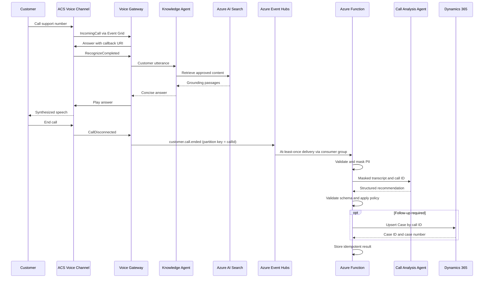

# Sequence Flow

```mermaid
sequenceDiagram
    participant Customer
    participant ACS as ACS Voice Channel
    participant Gateway as Voice Gateway
    participant Knowledge as Knowledge Agent
    participant Search as Azure AI Search
    participant EventHub as Azure Event Hubs
    participant Worker as Azure Function
    participant Analysis as Call Analysis Agent
    participant Dynamics as Dynamics 365

    Customer->>ACS: Call support number
    ACS->>Gateway: IncomingCall via Event Grid
    Gateway->>ACS: Answer with callback URI
    ACS->>Gateway: RecognizeCompleted
    Gateway->>Knowledge: Customer utterance
    Knowledge->>Search: Retrieve approved content
    Search-->>Knowledge: Grounding passages
    Knowledge-->>Gateway: Concise answer
    Gateway->>ACS: Play answer
    ACS-->>Customer: Synthesized speech
    Customer->>ACS: End call
    ACS->>Gateway: CallDisconnected
    Gateway->>EventHub: customer.call.ended (partition key = callId)
    EventHub->>Worker: At-least-once delivery via consumer group
    Worker->>Worker: Validate and mask PII
    Worker->>Analysis: Masked transcript and call ID
    Analysis-->>Worker: Structured recommendation
    Worker->>Worker: Validate schema and apply policy
    opt Follow-up required
        Worker->>Dynamics: Upsert Case by call ID
        Dynamics-->>Worker: Case ID and case number
    end
    Worker->>Worker: Store idempotent result
```
