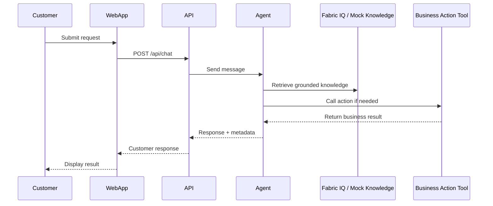

# Sequence Flow

```mermaid
sequenceDiagram
    participant Customer
    participant WebApp
    participant API
    participant Agent
    participant Knowledge as Fabric IQ / Mock Knowledge
    participant Tool as Business Action Tool

    Customer->>WebApp: Submit request
    WebApp->>API: POST /api/chat
    API->>Agent: Send message
    Agent->>Knowledge: Retrieve grounded knowledge
    Agent->>Tool: Call action if needed
    Tool-->>Agent: Return business result
    Agent-->>API: Response + metadata
    API-->>WebApp: Customer response
    WebApp-->>Customer: Display result
```
