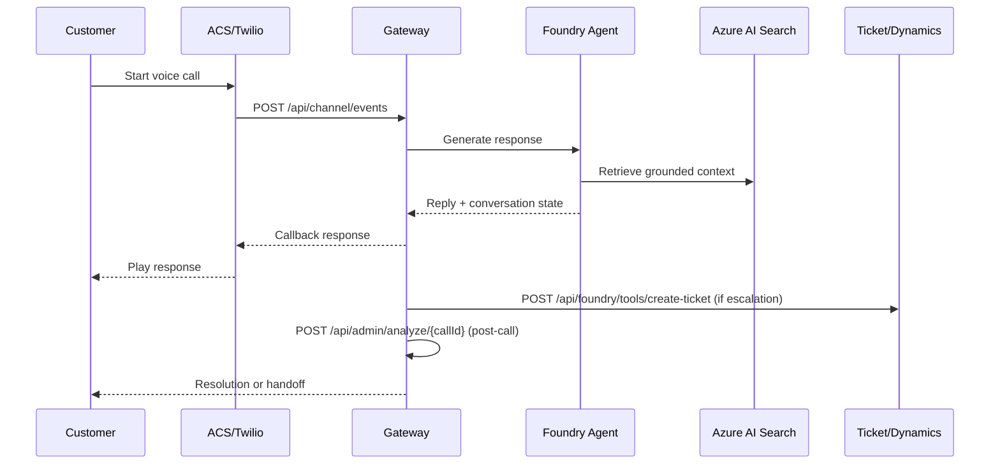

# Sequence Flow

```mermaid
sequenceDiagram
    participant Customer
    participant Channel as ACS/Twilio
    participant Gateway
    participant Foundry as Foundry Agent
    participant Knowledge as Azure AI Search
    participant Ticket as Ticket/Dynamics

    Customer->>Channel: Start voice call
    Channel->>Gateway: POST /api/channel/events
    Gateway->>Foundry: Generate response
    Foundry->>Knowledge: Retrieve grounded context
    Foundry-->>Gateway: Reply + conversation state
    Gateway-->>Channel: Callback response
    Channel-->>Customer: Play response
    Gateway->>Ticket: POST /api/foundry/tools/create-ticket (if escalation)
    Gateway->>Gateway: POST /api/admin/analyze/{callId} (post-call)
    Gateway-->>Customer: Resolution or handoff
```
