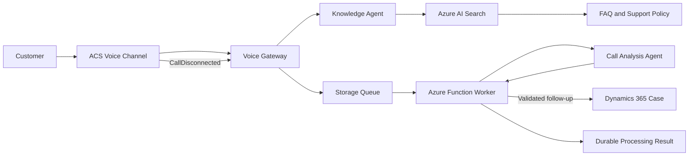

# Solution Architecture

## Logical Architecture

## Main Components

| Component | Purpose |
| --- | --- |
| ACS Voice Channel | Receives the PSTN call and delivers speech events |
| Voice Gateway | Answers calls, manages callbacks, and connects speech to the Knowledge Agent |
| Knowledge Agent | Generates concise customer-facing answers grounded by Search |
| Azure AI Search | Retrieves approved FAQ and support-policy content |
| Storage Queue | Decouples live calls from post-call processing |
| Azure Function Worker | Masks PII, validates analysis, applies policy, and performs writes |
| Call Analysis Agent | Produces structured summary and follow-up recommendation |
| Dynamics 365 | Stores idempotent Cases requiring human follow-up |
| Operations Dashboard | Optional view over call and processing records; not in the critical path |

## Design Principle

The workshop follows the **customer call lifecycle**, not a product catalog. Real-time answering and asynchronous post-call operations have separate reliability and security boundaries.
