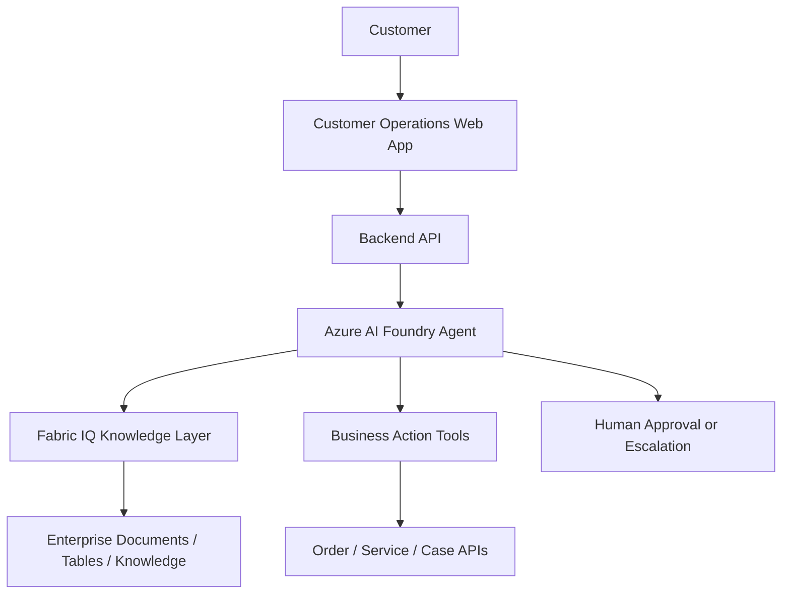

# Solution Architecture

## Logical Architecture

## Main Components

| Component | Purpose |
|---|---|
| Customer Operations Web App | User interface for customer requests |
| Backend API | Mediates frontend, agent, and business systems |
| Azure AI Foundry Agent | Understands request, reasons, uses knowledge and tools |
| Fabric IQ | Provides enterprise knowledge grounding |
| Business APIs | Performs operational actions |
| Human Approval | Handles escalation and controlled execution |

## Design Principle

The workshop should be organized by **customer request journey**, not by individual product features.
