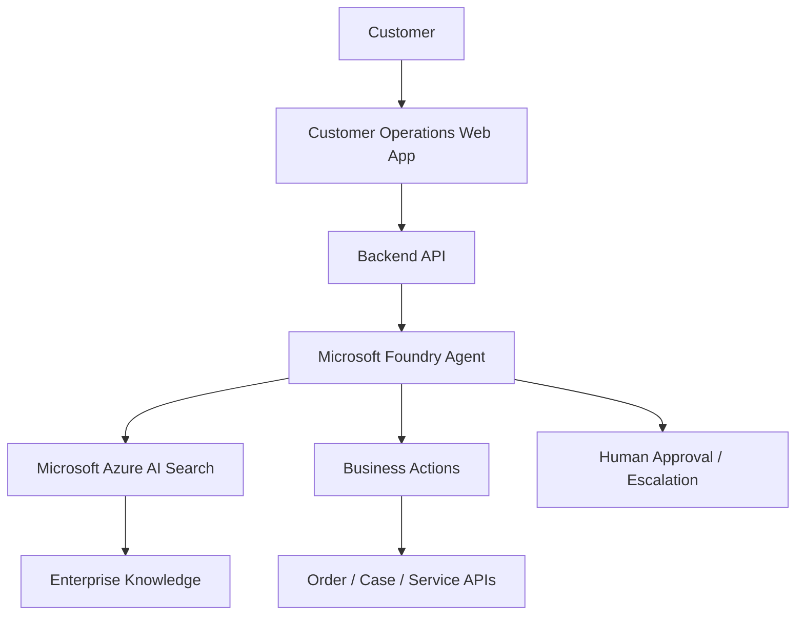

# Workshop - Intelligent Customer Operations

## Build AI Customer Operations Agents with Microsoft Foundry and Azure AI Search

This workshop guides learners through building an intelligent customer request automation solution.

!!! abstract "What you will build"
    An end-to-end customer operations application where a user submits a request, an AI agent understands the intent, retrieves enterprise knowledge from Azure AI Search, calls business APIs when needed, and returns a response or escalation decision.

## Target Scenario

A customer contacts the support team with requests such as:

- “How do I configure product warranty registration?”
- “Can you check the status of my repair request?”
- “I need to escalate this issue to a specialist.”

The solution will use:

- **Azure AI Search** for enterprise knowledge grounding.
- **Microsoft Foundry Agent** for reasoning and orchestration.
- **Business APIs / Azure Functions** for actions such as order lookup or ticket creation.
- **Customer Operations App** as the end-user interface.

## Learning Path

```text
Overview
  ↓
Environment Setup
  ↓
Knowledge Foundation with Azure AI Search
  ↓
Build AI Agent with Microsoft Foundry
  ↓
Business Actions & Tool Calling
  ↓
Deploy Application
  ↓
End-to-End Validation
  ↓
Multi-Agent Extension
```

## Architecture at a Glance



## Recommended Audience

- Solution Engineers
- Cloud Architects
- AI App Developers
- Data Engineers
- Customer Service Transformation Teams

## Workshop Outcome

By the end of this workshop, learners should understand how to design and implement a customer operations automation solution combining data, AI agents, and business systems.

