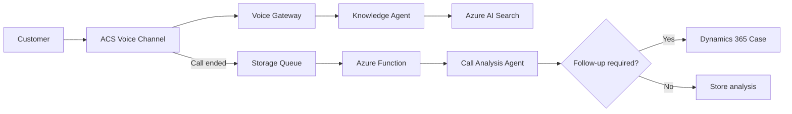

# Workshop - Intelligent Customer Operations

## Build an AI-Powered Voice Support Lifecycle

This workshop guides learners through building an intelligent customer support lifecycle with grounded answers during a voice call and automated follow-up after the call.

!!! abstract "What you will build"
    A Knowledge Agent grounded by Azure AI Search, an ACS Voice Channel that connects customers to that agent, and an event-driven post-call workflow that analyzes the conversation and creates a Dynamics 365 case when follow-up is required.

## Target Scenario

A customer calls the support team with questions such as:

- “How do I configure product warranty registration?”
- “Why was I charged twice for my subscription?”
- “This issue is still unresolved. What happens next?”

The solution will use:

- **Azure AI Search** for enterprise knowledge grounding.
- **Knowledge Agent** for grounded, multilingual answers during the call.
- **Azure Communication Services** for the voice channel.
- **Call Analysis Agent** for structured post-call review.
- **Azure Functions and Storage Queue** for event-driven processing.
- **Dynamics 365 Customer Service** for cases requiring follow-up.

## Learning Path

```text
Overview and Shared Setup
  ↓
Part 1: Build the Knowledge Agent
  ↓
Part 2: Build the Voice Channel
  ↓
Part 3: Analyze Calls and Create Tickets
```

## Architecture at a Glance



## Recommended Audience

- Solution Engineers
- Cloud Architects
- AI App Developers
- Data Engineers
- Customer Service Transformation Teams

## Workshop Outcome

By the end of this workshop, learners can demonstrate a complete customer-call lifecycle: grounded voice assistance, a durable call-ended event, structured post-call analysis, and conditional Dynamics 365 case creation.
