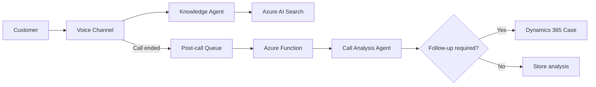

# Module 00 - Workshop Overview

## Goal

Help participants understand the business scenario, the customer request lifecycle, the role of each key component, and what will be built during this workshop.

## Business Scenario

Customer support teams receive repetitive questions by phone, but every call still requires a consistent answer, a complete transcript, and reliable follow-up when the issue remains unresolved.

This workshop demonstrates how AI agents can help customer operations teams:

- Ground answers in approved enterprise knowledge
- Serve customers through a real-time voice channel
- Review completed calls asynchronously
- Create Dynamics 365 cases when follow-up is required

The result is a faster, more consistent customer operations experience — without replacing the human judgment required for complex or sensitive situations.

## Call Lifecycle

The core storyline of this workshop follows a single customer request through the full resolution lifecycle:

The workshop follows this lifecycle in three parts: prepare knowledge, serve the live call, and complete post-call analysis and action.

## Target Architecture

The solution is composed of seven major components:

| Component | Role |
| --- | --- |
| Knowledge Agent | Answers customer questions using approved enterprise knowledge |
| Azure AI Search | Provides fast, low-latency vector search over indexed enterprise content |
| Voice Channel | Connects the customer call to the Knowledge Agent |
| Voice Gateway | Handles ACS events, speech recognition, playback, and conversation state |
| Post-call Queue | Decouples call completion from asynchronous processing |
| Call Analysis Agent | Summarizes the transcript and recommends follow-up action |
| Azure Function | Validates the analysis and executes deterministic business actions |
| Dynamics 365 | Stores cases that require human follow-up |

## Agent Responsibilities

| Component | Responsibility |
| --- | --- |
| Knowledge Agent | Retrieve knowledge and generate grounded customer-facing answers |
| Voice Channel | Transport speech and text; it is not a separate agent |
| Call Analysis Agent | Produce structured post-call analysis and a ticket recommendation |
| Azure Function | Decide and perform the Dynamics write using validated agent output |

Azure AI Search indexes your organization's existing knowledge — product documentation, support policies, operational data — and serves it to the agent in real time with sub-second latency.

## Workshop Scope

During this workshop, participants will:

- Build a Knowledge Agent connected to Azure AI Search
- Connect an ACS-based Voice Channel to the Knowledge Agent
- Publish a call-ended event after the conversation completes
- Build a Call Analysis Agent with a structured output contract
- Process post-call events with an Azure Function
- Create a Dynamics 365 case only when follow-up is required

This workshop focuses on a minimum runnable customer operations experience. The goal is a working flow — not a production-hardened deployment.

## Future Expansion

The following capabilities are important for production or advanced scenarios, but are not the primary focus of this workshop:

- Full Fabric IQ / OneLake integration with production data sources
- Microsoft Foundry Agent deployment at scale
- Multi-agent orchestration with supervisor and specialist agents
- Human approval and handoff workflows
- Advanced observability, evaluation, and model quality tuning
- Production-grade security and governance
- Customer-specific industry scenario packs

Future modules or extensions can replace workshop-scope components with fully Azure-integrated services when needed.

## Module Roadmap

| Module | Name | Focus |
| --- | --- | --- |
| 00 | Workshop Overview | Call lifecycle, architecture, and scope |
| 01 | Shared Environment Setup | Azure, Foundry, Search, ACS, Storage, and hosting prerequisites |
| Part 1 | Build the Knowledge Agent | Azure AI Search RAG and grounded-answer validation |
| Part 2 | Build the Voice Channel | Connect ACS calls to the Knowledge Agent |
| Part 3 | Analyze Calls and Create Tickets | Call-ended event, Azure Function, Analysis Agent, and Dynamics 365 |

## Recommended Read Order

1. This document (Module 00 overview)
2. `docs/architecture/solution-architecture.md`
3. `docs/architecture/sequence-flow.md`
4. Module 01 — `docs/modules/module01-environment-setup/index.md`

## Expected Output

By the end of Module 00, participants should have a shared understanding of:

- The business problem this workshop addresses
- The target customer call lifecycle
- The role of each major component
- The workshop module flow
- What will be implemented during the workshop
- What can be expanded later

## Exit Criteria

- [ ] Participants understand the customer call lifecycle
- [ ] Participants understand the target architecture and key components
- [ ] Participants understand the workshop scope and expected outcome
- [ ] Participants understand which capabilities are future expansion items
- [ ] Participants are ready to proceed to environment setup in Module 01

## Module Checklist

- [ ] Read this overview
- [ ] Review architecture links above
- [ ] Confirm shared understanding of scope and components with team
- [ ] Proceed to Module 01
