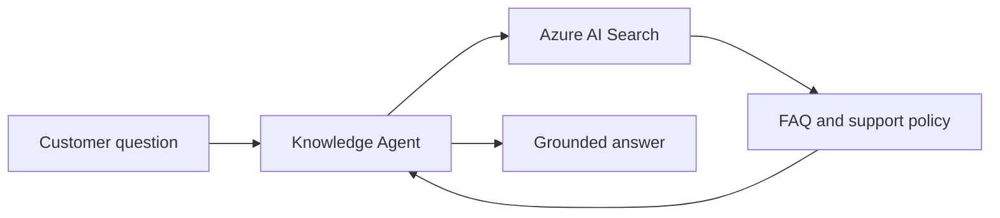

# Part 1 - Build the Knowledge Agent

## Goal

Create a Microsoft Foundry agent that uses Azure AI Search to answer customer questions from approved workshop content.

## What You Will Build

The Knowledge Agent is used twice in the workshop:

- Directly in the Foundry playground during Part 1.
- Through the Voice Gateway during Part 2.

It does not create Dynamics tickets. Post-call action belongs to the Call Analysis workflow in Part 3.

## Exercises

1. **Prepare and verify enterprise knowledge** - Confirm the Search index and retrieval behavior.
2. **Create the Knowledge Agent** - Configure instructions and connect the Search tool.
3. **Validate RAG quality** - Test grounding, unknown-answer handling, and multilingual behavior.

## Expected Output

- Search index `customer-operations-knowledge`
- Foundry agent `customer-knowledge-agent-$postfix`
- Azure AI Search tool connected to the agent
- `FOUNDRY_AGENT_ID` recorded in `.env`
- A repeatable RAG validation set

## Exit Criteria

- [ ] Search returns relevant workshop documents
- [ ] Knowledge Agent answers supported questions with grounded information
- [ ] Knowledge Agent does not invent unsupported policy
- [ ] English, Japanese, and Chinese prompts are tested
- [ ] Agent ID is recorded for Part 2
