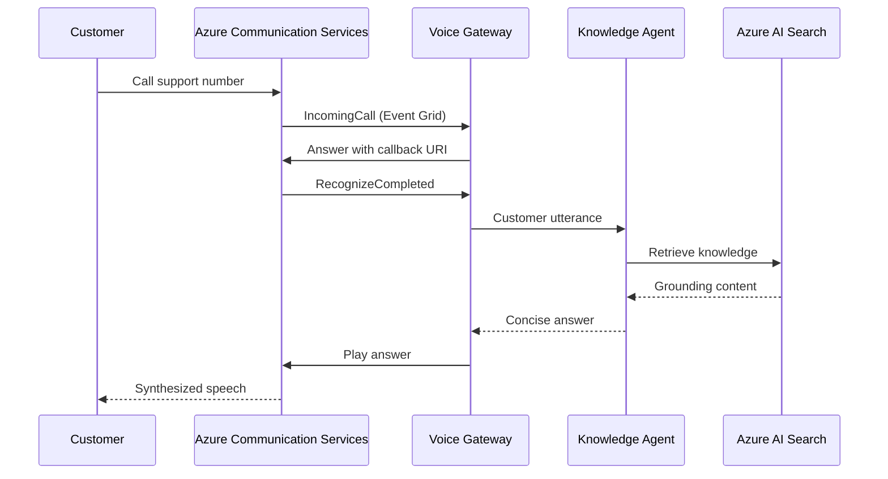

# Part 2 - Build the Voice Channel

## Goal

Connect an inbound Azure Communication Services call to the Part 1 Knowledge Agent through the workshop Voice Gateway.

## What You Will Build

The Voice Channel is a communication layer, not a third agent. The Gateway handles telephony events, conversation state, speech recognition, and playback while reusing the Knowledge Agent from Part 1.

## Exercises

1. **Deploy and configure the Voice Gateway**
2. **Connect ACS inbound-call events**
3. **Validate a grounded voice conversation**

## Expected Output

- Public Voice Gateway endpoint
- ACS phone number for inbound testing
- Event Grid subscription for `Microsoft.Communication.IncomingCall`
- Gateway connected to the Part 1 Knowledge Agent
- Completed call record with customer and assistant turns

## Exit Criteria

- [ ] Gateway health and configuration checks pass
- [ ] Event Grid subscription is active
- [ ] ACS answers an inbound call
- [ ] Knowledge Agent response is played to the caller
- [ ] `CallDisconnected` marks the call completed
