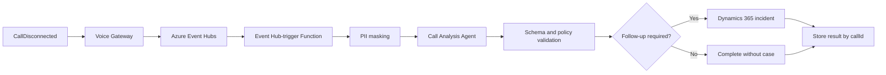

# Part 3 - Analyze Calls and Create Tickets

## Goal

Turn a completed call into a durable event, analyze its masked transcript with a second Foundry agent, and conditionally create a Dynamics 365 Customer Service case.

## What You Will Build

## Responsibility Boundary

The Call Analysis Agent recommends follow-up. It never writes to Dynamics. Deterministic Function code validates the output, applies the business rule, checks idempotency, and performs the Dataverse write.

This Part completes two intentional starter-code checkpoints:

- `AcsAdapter` must publish the completed call when it receives `CallDisconnected`.
- `PostCallEventHubFunction` must validate analysis and invoke a Worker-owned Dynamics client.

## Exercises

1. **Create the Call Analysis Agent**
2. **Publish and process the call-ended event**
3. **Configure conditional Dynamics case creation**
4. **Validate the complete lifecycle**

## Exit Criteria

- [ ] Exactly two Foundry agents exist: Knowledge and Call Analysis
- [ ] Every completed call produces one versioned Event Hub event
- [ ] Analysis follows the required JSON contract
- [ ] PII is masked before agent invocation
- [ ] Dynamics writes are deterministic and idempotent
- [ ] Resolved calls do not create cases
- [ ] Follow-up calls create at most one case
